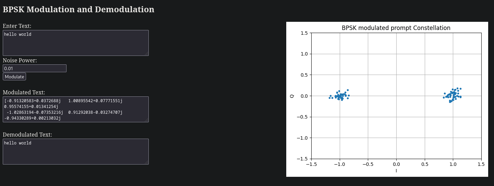

# HigherGroundHW
Some homework problems for an interview with Higher Ground LLC

This started as a mini homework assignment but I enjoyed this. It was a cool mini-project. I did some crude BPSK modulation and demodulation and plotted its IQ constellation. I threw this all into a flask app to visualize it. I added the abilty to put AWGN onto the modulated data to make it a little less boring and not a perfect IQ bpsk. You can asjust the power of the noise on the web page too. I experimented with using chatgpt to generate the flask for me. I did this for a couple reasons. First, this was an extra feature ontop of the assignment so I did not subtract from its purpose or integruity. Second, I'm taking a course on deep learning right now, very good course, and its timely relavent for me to use chatgpt and get a better feel for how to feed it good prompts and an intuition for its behavior. My final project in that class is using the chatgpt api to make a calendar planning / scheduling assistant. So, this allowed me to both play with chatgpt more and also add a cool feature to this project. Lastly, I though this all in docker. 

# usage
## ENV
Setup a python environment to keep your local environment clean.
1) `virtualenv ./env`
2) `source ./env/bin/activate`
3) `pip install -r requirements.txt`

## build docker
1) `docker build --tag bpsk .`
2) check the image exist with `docker iamages`
   
## run docker
1) `docker run -p 5000:5000 bpsk`

# Useful resources
I knew the background of a lot of this before doing this project but I had not written any code to handle of this before. Even still, I found the docs for pysdy to be super well written and easy to follow. Definitly worth a read!

1) [pysdr modulation](https://pysdr.org/content/digital_modulation.html )
2) [pysdr IQ sampling](https://pysdr.org/content/sampling.html)
3) [pysdr pulse shaping](https://pysdr.org/content/pulse_shaping.html) not as related but also good read
4) [pysdr link budget](https://pysdr.org/content/link_budgets.html) related to the paper in the attached pdf

# example

